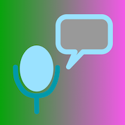

# iOS app - Hey ChatGPT

A minimal iOS app that interacts with ChatGPT. You can use your voice to ask questions and listen to ChatGPT's responses.

- Target devices: iPhone / iPad / Mac with M1/M2 (Designed for iPad)
- Target OS: iOS 16.0+, iPadOS 16.0+, macOS 13.0+
- Build system: Xcode 14.3+
- SDK: SwiftUI, AVFoundation, Speech
- Swift Packages: OpenAISwift (OpenAI API Client Library in Swift)

You can probably use Xcode 14.0+. However, it has not been tested.

## Change Log

none

## Abstract

This is a minimal iOS app that communicates with ChatGPT using OpenAI API.
The purpose of this project is showing a very basic sample code which uses the OpenAISwift Library.
The library abstracts and simplifies communication with OpenAI servers using the OpenAI API.

Users can receive answers to their questions from the OpenAI server.
Using the iOS SDK's speech recognition and text-to-speech, users can speak their questions and listen to the answers.

In order to use the OpenAI API, you need to sign up to the service and get the API key.
First you are given free credits. When it is used up, it is necessary to subscribe to a paid service.

### Features

- Users can input questions by voice.
- Users can get answers for the questions from ChatGTP, OpenAI's language AI.
- Users can listen answers by voice.
- Users can see their interaction history.

<!--

-->

<!--
## Preparation

### Getting the OpenAI API Key

### Add the API key file

### Check your credits

## Design

### Type Structure

The app consists of simple SwiftUI Views, UIKit Views, UIViewController, and Data types (Model types).

-->

<!--
## References

- Apple 
- Apple Documentation
- Apple Documentation
-->

## License

